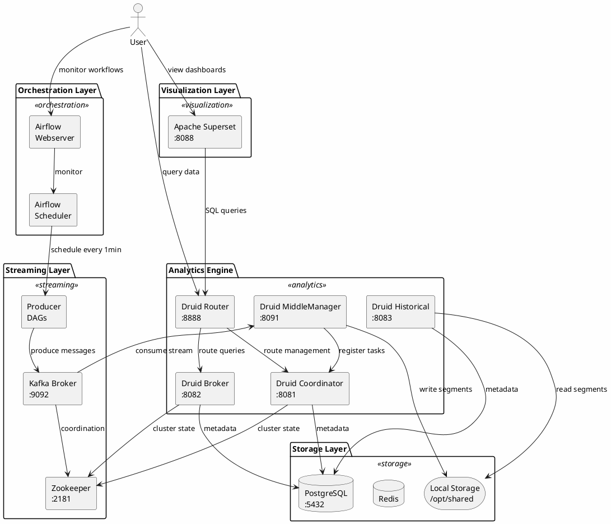

# Kiến Trúc Hệ Thống Real-Time Analytics

## Tổng Quan

Đây là một nền tảng phân tích dữ liệu thời gian thực (Real-Time Analytics Platform) sử dụng kiến trúc Lambda để xử lý dữ liệu streaming. Hệ thống thu thập, xử lý và trực quan hóa dữ liệu giá cryptocurrency theo thời gian thực.

## Sơ Đồ Kiến Trúc Tổng Quan



## Các Layer Chính

### 1. **Orchestration Layer** (Tầng Điều Phối)
**Công nghệ:** Apache Airflow 2.2.5

**Vai trò:**
- Lập lịch và thực thi các DAG (Directed Acyclic Graph)
- Tự động hóa việc sinh dữ liệu demo
- Quản lý workflow và dependencies

**Components:**
- **Airflow Scheduler**: Lập lịch chạy DAGs theo cron expression
- **Airflow Webserver**: UI để monitor và quản lý workflows
- **DAG Demo**: Chạy mỗi phút, sinh 4 messages (BTC, ETH, DOT, BTT)

**Port:** 3000 (mapped từ 8080 internal)

---

### 2. **Streaming Layer** (Tầng Streaming)
**Công nghệ:** Apache Kafka + Zookeeper

**Vai trò:**
- Message broker cho real-time data streaming
- Decoupling giữa producers và consumers
- Buffer dữ liệu với khả năng replay

**Components:**
- **Kafka Broker**: Nhận và lưu trữ messages trong topic "demo"
- **Zookeeper**: Quản lý cluster state và coordination
- **Producer**: Sinh dữ liệu cryptocurrency giả lập

**Message Format:**
```json
{
    "data_id": 150,
    "name": "BTC",
    "timestamp": 1645270401
}
```

**Ports:**
- Kafka: 9092 (internal), 29092 (external)
- Zookeeper: 2181 (internal), 22181 (external)

---

### 3. **Analytics Engine** (Tầng Phân Tích)
**Công nghệ:** Apache Druid 0.22.1+

**Vai trò:**
- OLAP database cho time-series data
- Real-time ingestion và indexing
- High-performance analytical queries
- Columnar storage với compression

**Components:**

#### **Druid Router** (:8888)
- Entry point cho tất cả requests
- Route queries đến Broker
- Route management requests đến Coordinator

#### **Druid Broker** (:8082)
- Query execution engine
- Merge results từ Historical và real-time segments
- Query optimization và caching

#### **Druid Coordinator** (:8081)
- Quản lý data availability
- Segment assignment đến Historical nodes
- Cluster management UI

#### **Druid Historical** (:8083)
- Lưu trữ immutable segments
- Serve queries cho historical data
- Load segments từ deep storage (/opt/shared)

#### **Druid MiddleManager** (:8091, :8100-8105)
- Ingest data từ Kafka
- Tạo real-time segments
- Execute indexing tasks
- Hand-off segments cho Historical

**Druid Extensions:**
- `druid-kafka-indexing-service`: Kafka integration
- `druid-datasketches`: Approximate algorithms
- `druid-histogram`: Histogram calculations
- `druid-multi-stage-query`: Complex query support

---

### 4. **Storage Layer** (Tầng Lưu Trữ)

#### **PostgreSQL** (:5432)
- Metadata storage cho Druid
- Lưu trữ segment metadata, task info, rules
- Docker image: postgres:14.1-alpine

#### **Redis**
- Caching layer (optional)
- Session management
- Fast key-value store

#### **Local File System** (/opt/shared)
- Deep storage cho Druid segments
- Shared volume giữa MiddleManager và Historical
- Production nên dùng S3/GCS/HDFS

---

### 5. **Visualization Layer** (Tầng Trực Quan Hóa)
**Công nghệ:** Apache Superset 1.4.1

**Vai trò:**
- Business Intelligence platform
- Tạo dashboards và charts
- SQL Lab cho ad-hoc queries
- Data exploration

**Connection:**
- SQLAlchemy URI: `druid://broker:8082/druid/v2/sql/`
- Query Druid thông qua SQL interface

**Port:** 8088

---

## Tech Stack Summary

### Backend & Processing
| Layer | Technology | Version |
|-------|-----------|---------|
| Workflow Orchestration | Apache Airflow | 2.2.5 |
| Message Streaming | Apache Kafka | 5.2.0 |
| Coordination | Apache Zookeeper | Latest |
| Analytics Engine | Apache Druid | 0.22.1+ |
| Programming Language | Python | 3.9 |

### Data Storage
| Component | Technology | Version |
|-----------|-----------|---------|
| Metadata Database | PostgreSQL | 14.1-alpine |
| Airflow Database | SQLite | Default |
| Caching | Redis | Latest |
| Deep Storage | Local FS | /opt/shared |

### Visualization & BI
| Component | Technology | Version |
|-----------|-----------|---------|
| Dashboard | Apache Superset | 1.4.1 |
| Database Connector | SQLAlchemy | Latest |

### Infrastructure
| Component | Technology | Version |
|-----------|-----------|---------|
| Containerization | Docker | Latest |
| Orchestration | Docker Compose | 3.8 |

### Python Libraries
```
kafka-python==2.0.2
psycopg2==2.9.3
numpy==1.24.2
pandas==1.5.3
```

---

## Port Mapping Reference

| Service | Internal Port | External Port | Purpose |
|---------|---------------|---------------|---------|
| Airflow | 8080 | 3000 | Workflow UI |
| Kafka | 9092 | 29092 | Message Broker |
| Zookeeper | 2181 | 22181 | Coordination |
| PostgreSQL | 5432 | 5432 | Metadata DB |
| Druid Router | 8888 | 8888 | Unified API |
| Druid Broker | 8082 | 8082 | Query Engine |
| Druid Coordinator | 8081 | 8081 | Management UI |
| Druid Historical | 8083 | 8083 | Storage Node |
| Druid MiddleManager | 8091 | 8091 | Task Execution |
| Superset | 8088 | 8088 | BI Dashboard |

---

## Deployment

### Khởi động hệ thống:
```bash
docker-compose up -d
```

### Truy cập các UI:
- **Airflow**: http://localhost:3000
- **Druid Console**: http://localhost:8888
- **Superset**: http://localhost:8088
- **Druid Coordinator**: http://localhost:8081

### Kiểm tra logs:
```bash
docker-compose logs -f [service-name]
```

---

## Production Considerations

### Hiện tại (Demo):
- ✅ SequentialExecutor (Airflow)
- ✅ SQLite metadata (Airflow)
- ✅ Local file storage (Druid)
- ✅ Single Kafka broker
- ✅ No replication

### Production nên có:
- 🔧 CeleryExecutor hoặc KubernetesExecutor
- 🔧 PostgreSQL/MySQL cho Airflow metadata
- 🔧 S3/GCS/Azure Blob cho Druid deep storage
- 🔧 Kafka cluster với replication ≥ 3
- 🔧 Multiple Druid nodes cho high availability
- 🔧 Monitoring (Prometheus + Grafana)
- 🔧 Authentication & Authorization
- 🔧 SSL/TLS encryption
- 🔧 Auto-scaling capabilities

---

## Tham Khảo

- [Apache Airflow Documentation](https://airflow.apache.org/docs/)
- [Apache Kafka Documentation](https://kafka.apache.org/documentation/)
- [Apache Druid Documentation](https://druid.apache.org/docs/latest/design/)
- [Apache Superset Documentation](https://superset.apache.org/docs/intro)
