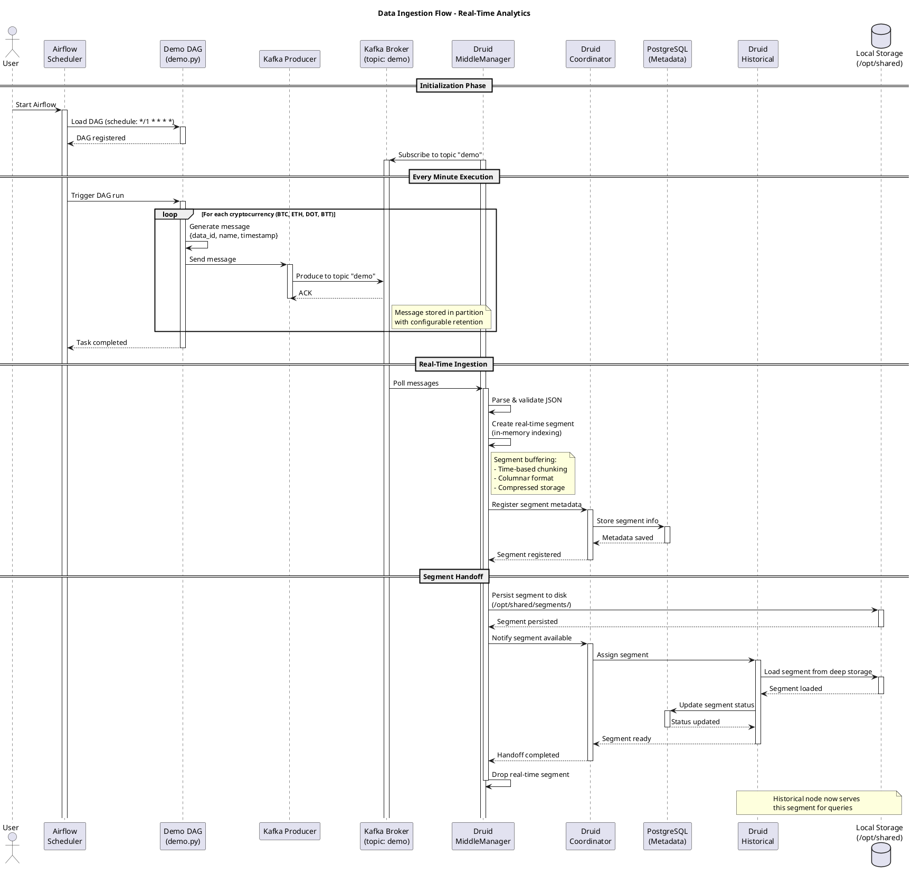
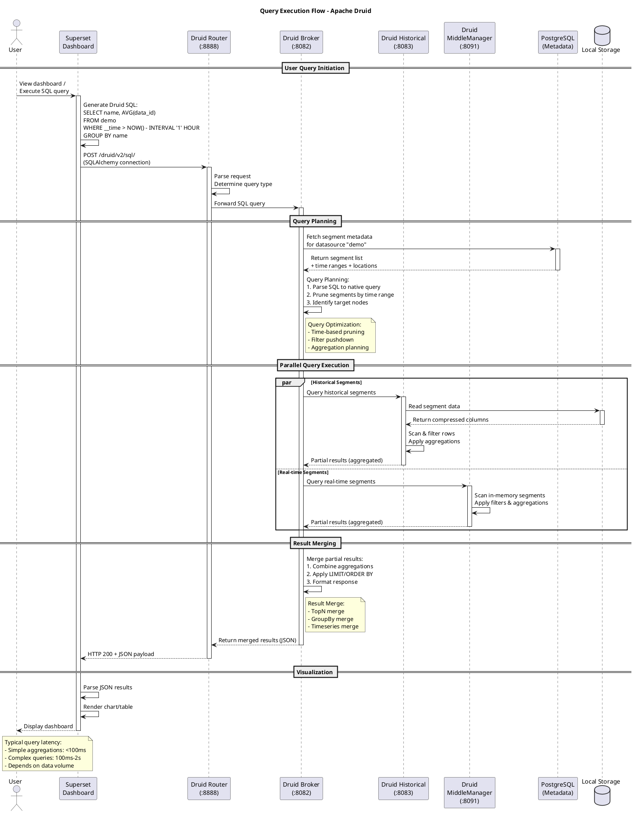
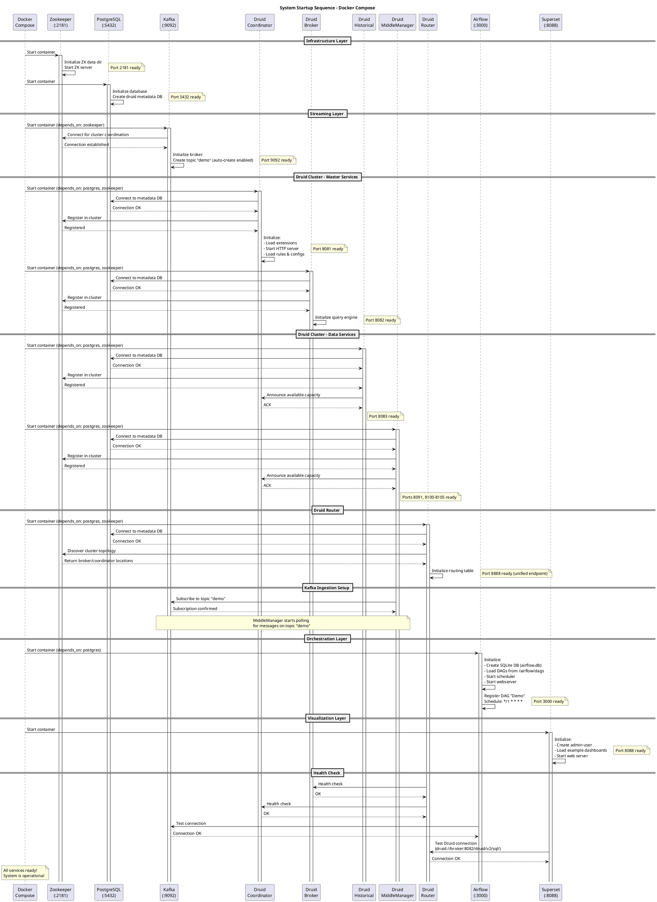
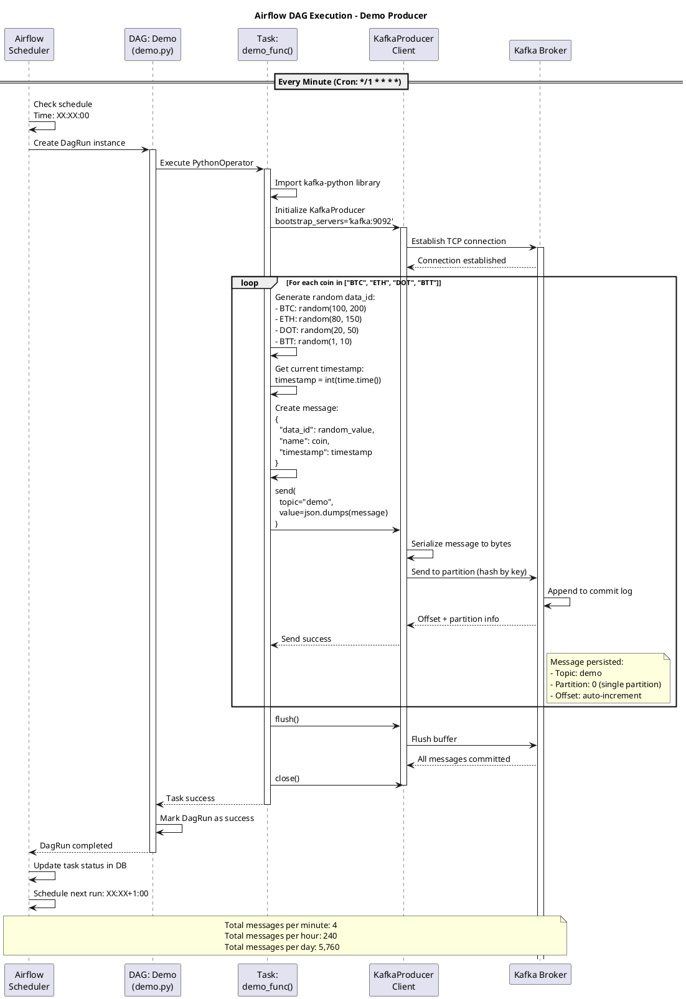
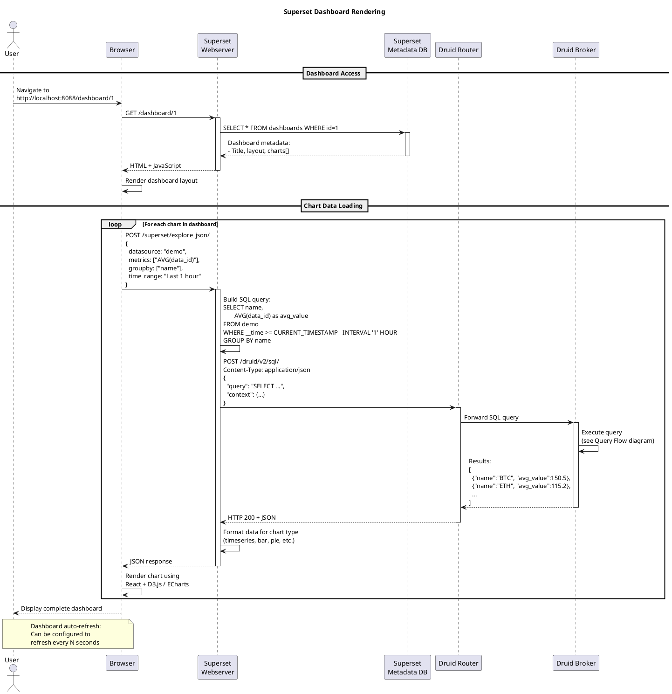

# Sequence Diagrams - Real-Time Analytics Platform

## 1. Data Ingestion Flow (Luồng Nhập Dữ Liệu)

Sơ đồ này mô tả luồng dữ liệu từ khi Airflow sinh message cho đến khi dữ liệu được lưu trong Druid.

---

## 2. Query Flow (Luồng Truy Vấn)

Sơ đồ này mô tả cách một query SQL từ Superset được xử lý qua các components của Druid.

---

## 3. System Startup Sequence (Khởi Động Hệ Thống)

Sơ đồ này mô tả thứ tự khởi động và dependencies giữa các services khi chạy `docker-compose up`.

---

## 4. Airflow DAG Execution Detail

Sơ đồ chi tiết về cách DAG "Demo" thực thi mỗi phút.

---

## 5. Superset Dashboard Load Sequence

Sơ đồ mô tả cách Superset load dashboard và query Druid.

---

## Giải Thích Các Flow

### 1. Data Ingestion Flow
**Mục đích:** Đưa dữ liệu từ source vào Druid để có thể query được

**Các bước chính:**
1. **Scheduling (0-1s):** Airflow scheduler trigger DAG mỗi phút
2. **Production (1-2s):** DAG sinh 4 messages và gửi vào Kafka topic "demo"
3. **Buffering (2-3s):** Kafka lưu messages vào partition với durability
4. **Real-time Ingestion (3-5s):** MiddleManager consume messages và tạo real-time segments in-memory
5. **Indexing (real-time):** Data được index dạng columnar, compressed
6. **Handoff (mỗi 10 phút):** Real-time segments được persist xuống disk và hand-off cho Historical nodes
7. **Long-term Storage:** Historical nodes serve data cho queries

**Latency:** Sub-second từ Kafka đến queryable trong Druid

---

### 2. Query Flow
**Mục đích:** Thực thi SQL query và trả về kết quả

**Các bước chính:**
1. **User Input:** User viết SQL trong Superset hoặc gọi API
2. **Routing (Router):** Router nhận request và forward đến Broker
3. **Planning (Broker):**
   - Parse SQL thành native Druid query
   - Fetch segment metadata từ PostgreSQL
   - Prune segments không liên quan (time range filtering)
   - Xác định Historical/MiddleManager nodes cần query
4. **Parallel Execution:**
   - Query Historical nodes cho historical segments
   - Query MiddleManager cho real-time segments
   - Mỗi node thực thi partial aggregation
5. **Merge (Broker):** Merge kết quả từ tất cả nodes
6. **Return:** Trả JSON về cho client

**Performance:**
- Simple queries: <100ms
- Complex aggregations: 100ms-2s
- Scan queries: tùy data volume

---

### 3. System Startup
**Mục đích:** Khởi động toàn bộ stack theo đúng dependencies

**Thứ tự:**
1. **Infrastructure:** Zookeeper, PostgreSQL (không phụ thuộc gì)
2. **Streaming:** Kafka (phụ thuộc Zookeeper)
3. **Druid Masters:** Coordinator, Broker (phụ thuộc Postgres + Zookeeper)
4. **Druid Data:** Historical, MiddleManager (phụ thuộc Postgres + Zookeeper)
5. **Druid Router:** Router (phụ thuộc Postgres + Zookeeper + Broker + Coordinator)
6. **Apps:** Airflow, Superset (phụ thuộc các services đã ready)

**Health checks:** Mỗi service tự kiểm tra dependencies trước khi declare "ready"

---

### 4. DAG Execution
**Mục đích:** Tự động sinh dữ liệu demo mỗi phút

**Chi tiết:**
- **Trigger:** Cron schedule `*/1 * * * *`
- **Execution time:** ~2-3 seconds
- **Messages per run:** 4 (BTC, ETH, DOT, BTT)
- **Data format:** JSON với random data_id và real timestamp
- **Delivery:** At-least-once delivery guarantee từ Kafka

---

### 5. Dashboard Rendering
**Mục đích:** Hiển thị real-time analytics cho user

**Workflow:**
1. User truy cập dashboard URL
2. Superset load dashboard config từ metadata DB
3. Superset render HTML + charts layout
4. Browser gọi API cho từng chart để lấy data
5. Superset chuyển đổi chart config thành Druid SQL
6. Druid thực thi query và trả về data
7. Browser render charts bằng JavaScript libraries

**Caching:** Superset có thể cache query results để giảm load lên Druid

---

## Notes về PlantUML

Để render các diagrams trên, bạn có thể:

1. **VS Code:** Cài extension "PlantUML"
2. **Online:** https://www.plantuml.com/plantuml/uml/
3. **CLI:** `plantuml diagram.puml` (cần Java + Graphviz)
4. **IntelliJ IDEA:** Built-in PlantUML support

Hoặc sử dụng Markdown viewers hỗ trợ PlantUML như GitLab, GitHub (với plugins), hoặc Obsidian.
