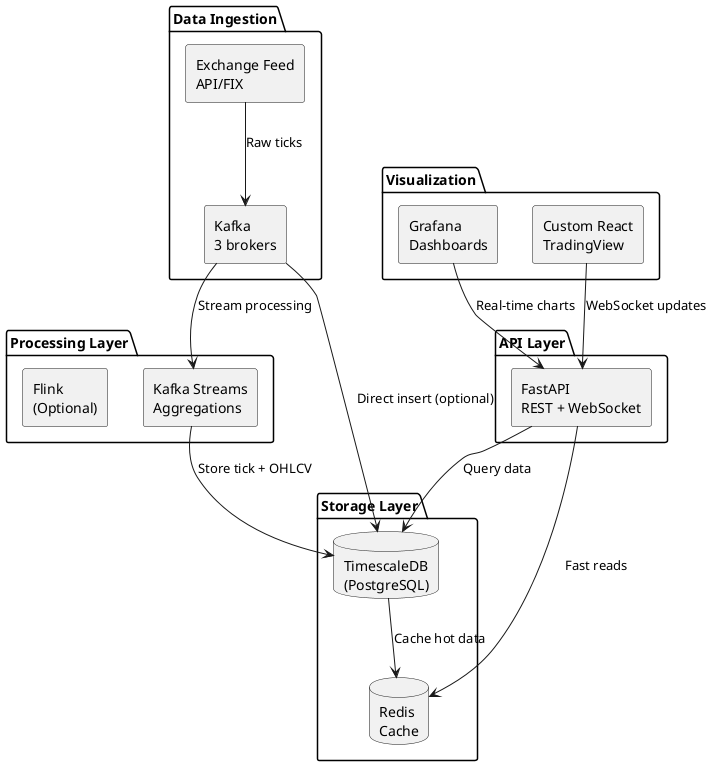
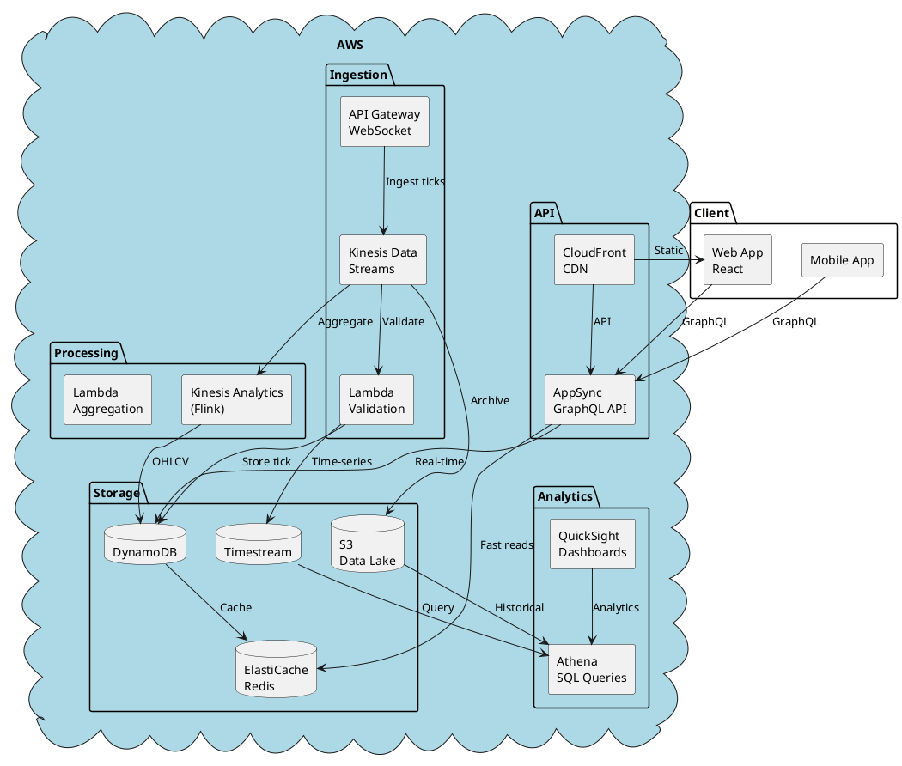
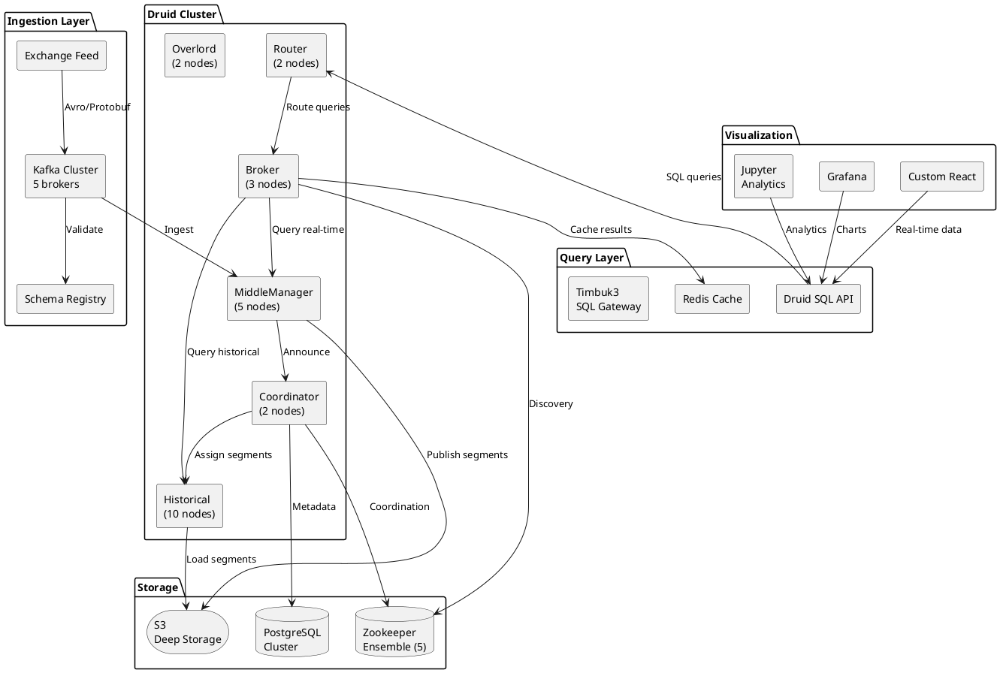
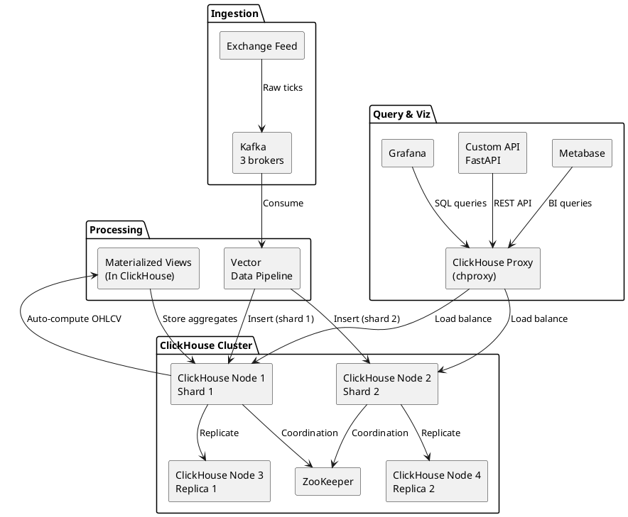

# Phương Án Tối Ưu Cho Dữ Liệu Chứng Khoán

## Mục Lục
1. [Yêu Cầu Đặc Thù Của Stock Market Data](#yêu-cầu-đặc-thù-của-stock-market-data)
2. [Đánh Giá Kiến Trúc Hiện Tại](#đánh-giá-kiến-trúc-hiện-tại)
3. [Phương Án 1: Simplified Stack (TimescaleDB)](#phương-án-1-simplified-stack-timescaledb)
4. [Phương Án 2: Cloud-Native (AWS)](#phương-án-2-cloud-native-aws)
5. [Phương Án 3: Optimized Druid (Production-Grade)](#phương-án-3-optimized-druid-production-grade)
6. [Phương Án 4: Hybrid (ClickHouse)](#phương-án-4-hybrid-clickhouse)
7. [So Sánh Chi Tiết](#so-sánh-chi-tiết)
8. [Khuyến Nghị Theo Use Case](#khuyến-nghị-theo-use-case)

---

## Yêu Cầu Đặc Thù Của Stock Market Data

### 📊 Đặc Điểm Dữ Liệu Chứng Khoán

#### 1. **Volume & Velocity**
```
Thị trường Việt Nam (HSX, HNX, UPCOM):
- Trading hours: 9:00 - 15:00 (6 hours)
- Stocks: ~1,700 symbols
- Peak volume: ~3,000-5,000 ticks/second
- Average: ~500-1,000 ticks/second
- Daily total: ~10-20 million events

Thị trường quốc tế (NYSE, NASDAQ):
- Trading hours: 9:30 - 16:00 (6.5 hours)
- Stocks: ~8,000 symbols (NYSE + NASDAQ)
- Peak volume: 50,000-100,000 events/second
- Average: 10,000-20,000 events/second
- Daily total: 200-500 million events
```

#### 2. **Data Types**

##### Tick Data (Real-time)
```json
{
  "symbol": "VCB",
  "timestamp": 1704441600000,  // Millisecond precision
  "price": 95500,
  "volume": 1000,
  "side": "BUY",              // BUY/SELL
  "matchType": "ATO",         // ATO, ATC, LO, MP
  "sequence": 12345           // Order sequence
}
```

##### OHLCV (Aggregated)
```json
{
  "symbol": "VCB",
  "interval": "1m",           // 1m, 5m, 15m, 1h, 1d
  "timestamp": 1704441600000,
  "open": 95000,
  "high": 96000,
  "low": 94500,
  "close": 95500,
  "volume": 150000,
  "value": 14325000000       // Trading value
}
```

##### Order Book (Level 2)
```json
{
  "symbol": "VCB",
  "timestamp": 1704441600000,
  "bids": [
    {"price": 95400, "volume": 5000},
    {"price": 95300, "volume": 8000},
    {"price": 95200, "volume": 12000}
  ],
  "asks": [
    {"price": 95500, "volume": 3000},
    {"price": 95600, "volume": 6000},
    {"price": 95700, "volume": 10000}
  ]
}
```

#### 3. **Latency Requirements**

```
Use Case                  | Latency Requirement | Criticality
--------------------------|---------------------|-------------
Real-time Dashboard       | < 100ms            | HIGH
Trading Signals           | < 50ms             | CRITICAL
Order Book Updates        | < 10ms             | CRITICAL
Historical Analysis       | < 2s               | MEDIUM
Charting (OHLCV)          | < 500ms            | HIGH
Alerts/Notifications      | < 1s               | HIGH
Backtesting              | < 5s               | LOW
```

#### 4. **Query Patterns**

##### Pattern 1: Time-series Queries (90% queries)
```sql
-- Get last 1 hour data for symbol
SELECT timestamp, price, volume
FROM ticks
WHERE symbol = 'VCB'
  AND timestamp >= NOW() - INTERVAL '1 hour'
ORDER BY timestamp DESC;

-- Get OHLCV for intraday chart
SELECT
  time_bucket('5 minutes', timestamp) as interval,
  first(price, timestamp) as open,
  max(price) as high,
  min(price) as low,
  last(price, timestamp) as close,
  sum(volume) as volume
FROM ticks
WHERE symbol = 'VCB'
  AND timestamp >= '2024-01-01 09:00:00'
GROUP BY interval
ORDER BY interval;
```

##### Pattern 2: Multi-symbol Aggregations (8% queries)
```sql
-- Top gainers today
SELECT
  symbol,
  (last_price - open_price) / open_price * 100 as change_percent,
  total_volume
FROM daily_summary
WHERE date = CURRENT_DATE
ORDER BY change_percent DESC
LIMIT 10;
```

##### Pattern 3: Complex Analytics (2% queries)
```sql
-- Calculate technical indicators (RSI, MACD, etc.)
-- Portfolio performance
-- Correlation analysis
```

#### 5. **Data Retention**

```
Data Type           | Retention | Storage Size (VN Market)
--------------------|-----------|-------------------------
Tick data (raw)     | 30 days   | ~1TB (compressed)
OHLCV (1m)          | 1 year    | ~50GB
OHLCV (5m, 15m)     | 3 years   | ~100GB
Daily data          | 10+ years | ~20GB
Order book snapshots| 7 days    | ~500GB
```

#### 6. **Compliance Requirements**

- ✅ Data integrity (no missing ticks)
- ✅ Audit trail (who accessed what, when)
- ✅ Data retention policies
- ✅ Regulatory reporting (SSI, FPT Securities requirements)
- ✅ Data encryption at rest and in transit
- ✅ Access control (RBAC)

---

## Đánh Giá Kiến Trúc Hiện Tại

### ⚠️ Phù Hợp Cho Stock Market? **CÓ ĐIỀU KIỆN**

| Aspect | Rating | Comment |
|--------|--------|---------|
| **Latency** | ✅ 7/10 | Sub-second ingestion OK, query latency acceptable |
| **Throughput** | ❌ 3/10 | Cannot handle peak volume (50k events/sec) |
| **Reliability** | ❌ 2/10 | No HA → unacceptable downtime risk |
| **Data Quality** | ❌ 3/10 | No validation → risk of bad data |
| **Charting** | ⚠️ 5/10 | Superset OK but not ideal for real-time charts |
| **Cost** | ❌ 4/10 | Expensive to scale with current design |
| **Compliance** | ❌ 2/10 | No audit trail, encryption, access control |

### 🎯 Verdict

**Kiến trúc hiện tại:**
- ✅ **OK for:** MVP, demo, testing với simulated data
- ⚠️ **Conditional for:** Small broker (< 100 users, < 100 symbols)
- ❌ **NOT OK for:** Production trading platform, enterprise use

**Major issues:**
1. **Cannot handle market open spike** (9:00-9:15 AM)
2. **No failover** → downtime = lost revenue
3. **Superset không real-time** → manual refresh
4. **Scaling cost cao** → expensive infrastructure

---

## Phương Án 1: Simplified Stack (TimescaleDB)

### 🎯 Best For
- ✅ Small to medium brokers
- ✅ Budget-conscious startups
- ✅ <10,000 symbols
- ✅ Regional markets (VN, Thailand, etc.)

### 📐 Architecture



### 🔧 Tech Stack

| Component | Technology | Why? |
|-----------|-----------|------|
| **Message Queue** | Apache Kafka (3 brokers) | Durability, replay, high throughput |
| **Stream Processing** | Kafka Streams | Simple aggregations (OHLCV) |
| **Database** | TimescaleDB (PostgreSQL) | Time-series optimized, SQL queries |
| **Cache** | Redis Cluster | Fast reads for hot data |
| **API** | FastAPI (Python) | WebSocket support, async |
| **Real-time Charts** | Grafana + Custom React | Auto-refresh, TradingView integration |
| **Infrastructure** | Docker + Kubernetes | Scalability, HA |

### 💾 TimescaleDB Schema

```sql
-- Enable TimescaleDB extension
CREATE EXTENSION IF NOT EXISTS timescaledb;

-- Tick data table (raw)
CREATE TABLE ticks (
  timestamp TIMESTAMPTZ NOT NULL,
  symbol TEXT NOT NULL,
  price NUMERIC(18, 2) NOT NULL,
  volume BIGINT NOT NULL,
  side TEXT,
  match_type TEXT,
  sequence BIGINT
);

-- Create hypertable (automatic partitioning by time)
SELECT create_hypertable('ticks', 'timestamp');

-- Indexes
CREATE INDEX idx_ticks_symbol_time ON ticks (symbol, timestamp DESC);

-- OHLCV table (aggregated)
CREATE TABLE ohlcv (
  time TIMESTAMPTZ NOT NULL,
  symbol TEXT NOT NULL,
  interval TEXT NOT NULL,  -- '1m', '5m', '1h', '1d'
  open NUMERIC(18, 2),
  high NUMERIC(18, 2),
  low NUMERIC(18, 2),
  close NUMERIC(18, 2),
  volume BIGINT,
  value BIGINT
);

SELECT create_hypertable('ohlcv', 'time');
CREATE INDEX idx_ohlcv_symbol_interval ON ohlcv (symbol, interval, time DESC);

-- Continuous aggregates (automatic OHLCV calculation)
CREATE MATERIALIZED VIEW ohlcv_1m
WITH (timescaledb.continuous) AS
SELECT
  time_bucket('1 minute', timestamp) AS time,
  symbol,
  '1m' as interval,
  first(price, timestamp) AS open,
  max(price) AS high,
  min(price) AS low,
  last(price, timestamp) AS close,
  sum(volume) AS volume,
  sum(price * volume) AS value
FROM ticks
GROUP BY time, symbol;

-- Refresh policy (update every 1 minute)
SELECT add_continuous_aggregate_policy('ohlcv_1m',
  start_offset => INTERVAL '3 minutes',
  end_offset => INTERVAL '1 minute',
  schedule_interval => INTERVAL '1 minute');

-- Data retention policy (drop old data automatically)
SELECT add_retention_policy('ticks', INTERVAL '30 days');
SELECT add_retention_policy('ohlcv', INTERVAL '3 years');

-- Compression (10x reduction in storage)
ALTER TABLE ticks SET (
  timescaledb.compress,
  timescaledb.compress_segmentby = 'symbol'
);

SELECT add_compression_policy('ticks', INTERVAL '7 days');
```

### 📈 Performance Benchmarks

**Hardware:** 3x r5.2xlarge (8 vCPU, 64GB RAM)

```
Metric                    | Value
--------------------------|---------------------------
Ingestion rate            | 100,000 ticks/second
Query latency (simple)    | 10-50ms
Query latency (complex)   | 100-500ms
Storage with compression  | 1TB → 100GB (10x)
Concurrent queries        | 1,000+
Retention (30d ticks)     | ~500GB for VN market
```

### 💰 Cost Estimate (AWS)

```
Monthly Costs:
- TimescaleDB (3x r5.2xlarge): $1,200
- Kafka (3x r5.xlarge): $600
- Redis (1x r5.large): $100
- API servers (2x r5.large): $200
- Load balancer: $20
- S3 backup: $50
- Total: ~$2,170/month

For 100k events/second processing capability!
```

### ✅ Pros

1. **Simple architecture** - PostgreSQL ecosystem familiar to developers
2. **SQL queries** - Easy analytics, BI tools integration
3. **Automatic aggregation** - Continuous aggregates = free OHLCV
4. **Compression** - 10x storage reduction
5. **Cost-effective** - $2k/month for high throughput
6. **Proven** - Used by many fintech companies

### ❌ Cons

1. **PostgreSQL limitations** - Not as fast as specialized OLAP DBs for very complex queries
2. **Scaling limits** - Single-node writes (can shard but complex)
3. **No built-in charting** - Need custom frontend

### 🎯 Ideal For

- Vietnamese stock market (HSX, HNX, UPCOM)
- Regional exchanges (Thailand, Philippines, etc.)
- Crypto exchanges (<50k events/sec)
- Budget: $2k-5k/month
- Team: Familiar with PostgreSQL

---

## Phương Án 2: Cloud-Native (AWS)

### 🎯 Best For
- ✅ Enterprise brokers
- ✅ Multi-region deployment
- ✅ Managed services (less ops)
- ✅ Rapid scaling needs

### 📐 Architecture



### 🔧 Tech Stack

| Component | AWS Service | Why? |
|-----------|-------------|------|
| **Ingestion** | Kinesis Data Streams | Fully managed, auto-scaling |
| **Stream Processing** | Kinesis Data Analytics (Flink) | Real-time aggregations |
| **Tick Storage** | DynamoDB | NoSQL, single-digit ms latency |
| **Time-series** | Timestream | Purpose-built for time-series |
| **Data Lake** | S3 + Parquet | Long-term storage, cheap |
| **Cache** | ElastiCache (Redis) | Sub-millisecond reads |
| **API** | AppSync (GraphQL) + Lambda | WebSocket, subscriptions |
| **Analytics** | Athena + QuickSight | SQL queries, dashboards |
| **CDN** | CloudFront | Global edge caching |

### 💾 Data Model

#### DynamoDB Schema (Tick Data)

```javascript
// Table: Ticks
{
  "PK": "SYMBOL#VCB",
  "SK": "TICK#1704441600000#12345",  // timestamp + sequence
  "symbol": "VCB",
  "timestamp": 1704441600000,
  "price": 95500,
  "volume": 1000,
  "side": "BUY",
  "TTL": 1707033600  // Expire after 30 days
}

// GSI: TimeIndex
// PK: DATE#2024-01-01
// SK: TIMESTAMP#1704441600000

// Table: OHLCV
{
  "PK": "SYMBOL#VCB#1m",
  "SK": "TIME#1704441600000",
  "symbol": "VCB",
  "interval": "1m",
  "timestamp": 1704441600000,
  "open": 95000,
  "high": 96000,
  "low": 94500,
  "close": 95500,
  "volume": 150000
}
```

#### Timestream Schema

```sql
-- Database: StockMarket
-- Table: Ticks

-- Dimensions (indexed)
symbol VARCHAR
side VARCHAR

-- Measures (values)
price DOUBLE
volume BIGINT

-- Time (automatic)
time TIMESTAMP

-- Query example
SELECT
  symbol,
  bin(time, 1m) as interval,
  CREATE_TIME_SERIES_AGG(price) as price_series
FROM Ticks
WHERE symbol = 'VCB'
  AND time BETWEEN ago(1h) AND now()
GROUP BY symbol, bin(time, 1m);
```

### 🔄 Data Flow

```
1. Tick arrives via WebSocket → API Gateway
   ↓
2. API Gateway → Kinesis Data Streams (1 shard per 1000 events/sec)
   ↓
3. Kinesis → Lambda (validation, enrichment)
   ↓
4a. Lambda → DynamoDB (hot data, 30 days)
4b. Lambda → Timestream (time-series queries)
4c. Kinesis → S3 (archive, Parquet format)
   ↓
5. Kinesis → Kinesis Data Analytics (Flink)
   ↓ Real-time aggregation (OHLCV)
6. Flink → DynamoDB (OHLCV tables)
   ↓
7. AppSync GraphQL API → ElastiCache (cache) → DynamoDB
   ↓
8. WebSocket subscription → Real-time updates to clients
```

### 📊 Performance

```
Metric                    | Value
--------------------------|---------------------------
Ingestion capacity        | 200,000 events/sec (auto-scale)
Write latency (DynamoDB)  | 5-10ms (p99)
Read latency (cache hit)  | <1ms
Read latency (DynamoDB)   | 5-10ms
Query latency (Timestream)| 100-500ms
WebSocket latency         | 50-100ms
Auto-scaling              | Yes, automatic
Multi-region              | Yes, Global Tables
```

### 💰 Cost Estimate (AWS)

```
Assumptions:
- 50,000 events/second during trading hours (6 hours)
- 1 billion events/day
- 30 days retention in DynamoDB
- 3 years retention in S3

Monthly Costs:
- Kinesis Data Streams (50 shards): $1,500
- Lambda invocations (1B/day): $800
- DynamoDB (30-day data, 1000 WCU, 500 RCU): $1,200
- Timestream (write + query): $600
- ElastiCache (r6g.large): $120
- S3 storage (50TB): $1,150
- S3 data transfer: $200
- Kinesis Analytics: $400
- AppSync: $100
- CloudFront: $50
- Total: ~$6,120/month

For global-scale, managed infrastructure!
```

### ✅ Pros

1. **Fully managed** - No server management
2. **Auto-scaling** - Handle any spike automatically
3. **Global** - Multi-region with low latency
4. **Serverless** - Pay per use
5. **Security** - IAM, encryption, VPC
6. **Monitoring** - CloudWatch built-in

### ❌ Cons

1. **AWS lock-in** - Hard to migrate
2. **Cost at scale** - Can get expensive with high volume
3. **Complexity** - Many services to orchestrate
4. **Cold starts** - Lambda latency spikes
5. **Learning curve** - AWS-specific knowledge needed

### 🎯 Ideal For

- Large brokers (>10,000 users)
- Multi-region requirements
- Variable load patterns
- Teams comfortable with AWS
- Budget: $5k-20k/month

---

## Phương Án 3: Optimized Druid (Production-Grade)

### 🎯 Best For
- ✅ High-volume exchanges (NYSE, NASDAQ scale)
- ✅ Complex analytics requirements
- ✅ OLAP-heavy workloads
- ✅ Multi-dimensional slicing/dicing

### 📐 Architecture (Improved Version)



### 🔧 Enhanced Configuration

#### Kafka Setup
```yaml
# 5-node Kafka cluster
kafka:
  brokers: 5
  replication_factor: 3
  min_insync_replicas: 2
  partitions_per_topic: 10  # Parallel ingestion

  # Performance tuning
  compression_type: lz4
  batch_size: 32768
  linger_ms: 5
  acks: 1  # Leader ack only for speed
```

#### Druid Ingestion Spec (Optimized)
```json
{
  "type": "kafka",
  "spec": {
    "dataSchema": {
      "dataSource": "stock_ticks",
      "timestampSpec": {
        "column": "timestamp",
        "format": "millis"
      },
      "dimensionsSpec": {
        "dimensions": [
          "symbol",
          "side",
          "match_type"
        ]
      },
      "metricsSpec": [
        {"type": "doubleSum", "name": "total_value", "fieldName": "value"},
        {"type": "longSum", "name": "total_volume", "fieldName": "volume"},
        {"type": "doubleMax", "name": "max_price", "fieldName": "price"},
        {"type": "doubleMin", "name": "min_price", "fieldName": "price"},
        {"type": "count", "name": "count"}
      ],
      "granularitySpec": {
        "type": "uniform",
        "segmentGranularity": "HOUR",  // 1-hour segments
        "queryGranularity": "SECOND",  // 1-second buckets
        "rollup": true  // Enable rollup for compression
      }
    },
    "tuningConfig": {
      "type": "kafka",
      "maxRowsInMemory": 1000000,  // 1M rows in memory
      "maxBytesInMemory": 536870912,  // 512MB
      "intermediatePersistPeriod": "PT10M",
      "maxPendingPersists": 3,
      "taskCount": 10,  // 10 parallel tasks
      "replicas": 2,    // 2 replicas for HA
      "taskDuration": "PT1H"  // 1-hour tasks
    },
    "ioConfig": {
      "topic": "stock_ticks",
      "consumerProperties": {
        "bootstrap.servers": "kafka:9092"
      },
      "taskCount": 10,
      "replicas": 2,
      "useEarliestOffset": true
    }
  }
}
```

#### Druid Cluster Configuration

##### Historical Nodes (10 nodes)
```properties
# Hardware: r5.4xlarge (16 vCPU, 128GB RAM, 1TB SSD)

# Processing
druid.processing.buffer.sizeBytes=2147483648  # 2GB per buffer
druid.processing.numThreads=15  # vCPU - 1
druid.processing.numMergeBuffers=4

# Segment cache
druid.segmentCache.locations=[{"path":"/data/segment-cache","maxSize":800g}]

# Query cache
druid.historical.cache.useCache=true
druid.historical.cache.populateCache=true
druid.cache.type=caffeine
druid.cache.sizeInBytes=10737418240  # 10GB
```

##### Broker Nodes (3 nodes)
```properties
# Hardware: r5.2xlarge (8 vCPU, 64GB RAM)

# Processing
druid.processing.buffer.sizeBytes=1073741824  # 1GB
druid.processing.numThreads=7
druid.processing.numMergeBuffers=2

# Query cache
druid.broker.cache.useCache=true
druid.broker.cache.populateCache=true
druid.cache.type=caffeine
druid.cache.sizeInBytes=21474836480  # 20GB

# Connection pool
druid.broker.http.numConnections=20
druid.broker.http.maxQueuedBytes=25000000
```

##### MiddleManager Nodes (5 nodes)
```properties
# Hardware: r5.2xlarge (8 vCPU, 64GB RAM)

# Worker capacity
druid.worker.capacity=10  # 10 tasks per node
druid.indexer.runner.javaOpts=-Xms4g -Xmx4g

# Task slots
druid.indexer.fork.property.druid.processing.numThreads=2
druid.indexer.fork.property.druid.processing.buffer.sizeBytes=536870912
```

### 🎯 Optimizations for Stock Market

#### 1. Rollup for Compression
```json
// Without rollup (raw ticks)
{timestamp: "2024-01-01 09:00:01", symbol: "VCB", price: 95000, volume: 100}
{timestamp: "2024-01-01 09:00:01", symbol: "VCB", price: 95000, volume: 200}
{timestamp: "2024-01-01 09:00:01", symbol: "VCB", price: 95000, volume: 150}
→ 3 rows, 300 bytes

// With rollup (aggregated to second)
{timestamp: "2024-01-01 09:00:01", symbol: "VCB", min: 95000, max: 95000, sum_volume: 450, count: 3}
→ 1 row, 120 bytes
→ 60% compression!
```

#### 2. Pre-aggregated OHLCV Datasource
```json
{
  "dataSource": "stock_ohlcv",
  "granularitySpec": {
    "segmentGranularity": "DAY",
    "queryGranularity": "MINUTE",  // Pre-aggregated to 1-minute
    "rollup": true
  },
  "metricsSpec": [
    {"type": "doubleFirst", "name": "open", "fieldName": "price"},
    {"type": "doubleMax", "name": "high", "fieldName": "price"},
    {"type": "doubleMin", "name": "low", "fieldName": "price"},
    {"type": "doubleLast", "name": "close", "fieldName": "price"},
    {"type": "longSum", "name": "volume", "fieldName": "volume"}
  ]
}
```

#### 3. Tiered Storage (Hot/Cold)
```properties
# Hot tier (SSDs): Last 7 days
# Cold tier (HDDs): 8-90 days
# S3: >90 days

# Load rules
[
  {
    "type": "loadByPeriod",
    "period": "P7D",
    "tieredReplicants": {
      "hot": 2
    }
  },
  {
    "type": "loadByPeriod",
    "period": "P90D",
    "tieredReplicants": {
      "cold": 1
    }
  },
  {
    "type": "dropForever"
  }
]
```

### 📊 Performance (Production Config)

```
Metric                       | Value
-----------------------------|---------------------------
Ingestion rate               | 500,000 events/second
Query latency (simple)       | 50-200ms
Query latency (complex)      | 500ms-2s
Concurrent queries           | 10,000+
Data compression ratio       | 10-20x (with rollup)
Retention (90d tick data)    | ~2TB compressed
Segment load time            | <5 seconds
Failover time                | <30 seconds (with replicas)
```

### 💰 Cost Estimate (AWS)

```
Monthly Costs:
- Historical (10x r5.4xlarge): $8,000
- Broker (3x r5.2xlarge): $1,800
- MiddleManager (5x r5.2xlarge): $3,000
- Coordinator + Overlord (4x r5.xlarge): $800
- Router (2x r5.large): $200
- PostgreSQL RDS (db.r5.large HA): $400
- Zookeeper (5x r5.large): $500
- Kafka (5x r5.xlarge): $1,000
- S3 deep storage (10TB): $230
- Load balancers: $50
- Total: ~$15,980/month

For NYSE/NASDAQ-scale processing!
```

### ✅ Pros

1. **Extreme scalability** - Handle millions of events/second
2. **Sub-second queries** - Even on billions of rows
3. **Flexible aggregations** - Roll-up, sketches, approximations
4. **Real-time + historical** - Unified query interface
5. **Proven at scale** - Used by Netflix, Airbnb, etc.

### ❌ Cons

1. **Expensive** - $16k/month minimum
2. **Complex** - Many moving parts
3. **Ops heavy** - Requires dedicated team
4. **Learning curve** - Steep for developers
5. **Overkill** - For smaller markets

### 🎯 Ideal For

- NYSE, NASDAQ, LSE scale exchanges
- >100,000 events/second
- Complex multi-dimensional analytics
- Large engineering teams
- Budget: $15k-50k/month

---

## Phương Án 4: Hybrid (ClickHouse)

### 🎯 Best For
- ✅ Maximum query performance
- ✅ Cost-conscious but high volume
- ✅ SQL-heavy analytics
- ✅ Real-time dashboards

### 📐 Architecture



### 🔧 Tech Stack

| Component | Technology | Why? |
|-----------|-----------|------|
| **Database** | ClickHouse | Fastest OLAP for analytics |
| **Message Queue** | Kafka | Reliable ingestion |
| **Data Pipeline** | Vector.dev | High-perf data transform |
| **Proxy** | chproxy | Query routing, caching |
| **Visualization** | Grafana + Metabase | Real-time + BI |
| **API** | FastAPI | WebSocket support |

### 💾 ClickHouse Schema

```sql
-- Ticks table (raw data)
CREATE TABLE ticks_local ON CLUSTER stock_cluster
(
    timestamp DateTime64(3),  -- Millisecond precision
    symbol LowCardinality(String),
    price Decimal(18, 2),
    volume UInt64,
    side Enum8('BUY' = 1, 'SELL' = 2),
    match_type LowCardinality(String),
    sequence UInt64
)
ENGINE = ReplicatedMergeTree('/clickhouse/tables/{shard}/ticks', '{replica}')
PARTITION BY toYYYYMMDD(timestamp)
ORDER BY (symbol, timestamp)
TTL timestamp + INTERVAL 30 DAY;  -- Auto-delete after 30 days

-- Distributed table (query across shards)
CREATE TABLE ticks ON CLUSTER stock_cluster AS ticks_local
ENGINE = Distributed(stock_cluster, default, ticks_local, rand());

-- Materialized view for OHLCV (auto-computed!)
CREATE MATERIALIZED VIEW ohlcv_1m_mv ON CLUSTER stock_cluster
ENGINE = ReplicatedSummingMergeTree('/clickhouse/tables/{shard}/ohlcv_1m', '{replica}')
PARTITION BY toYYYYMM(time)
ORDER BY (symbol, time)
AS SELECT
    toStartOfMinute(timestamp) AS time,
    symbol,
    argMin(price, timestamp) AS open,
    max(price) AS high,
    min(price) AS low,
    argMax(price, timestamp) AS close,
    sum(volume) AS volume,
    count() AS tick_count
FROM ticks_local
GROUP BY symbol, time;

-- Index for fast symbol lookups
ALTER TABLE ticks_local ADD INDEX idx_symbol (symbol) TYPE set(0) GRANULARITY 4;
```

### 🚀 Performance Tricks

#### 1. LowCardinality for String Compression
```sql
-- Without LowCardinality
symbol String  -- Stores "VCB" repeatedly → 3 bytes per row

-- With LowCardinality (dictionary encoding)
symbol LowCardinality(String)  -- Stores index → 1-2 bytes per row
→ 50% storage reduction for symbol column!
```

#### 2. Partition Pruning
```sql
-- Query with date filter
SELECT * FROM ticks
WHERE timestamp >= '2024-01-01'
  AND symbol = 'VCB';

-- ClickHouse only scans partitions: 2024-01-01, 2024-01-02, ...
-- Skips all other partitions → 100x faster!
```

#### 3. Projection for Pre-aggregation
```sql
-- Create projection (pre-computed aggregation)
ALTER TABLE ticks_local ADD PROJECTION ohlcv_projection
(
    SELECT
        symbol,
        toStartOfMinute(timestamp) AS minute,
        min(price), max(price),
        argMin(price, timestamp), argMax(price, timestamp),
        sum(volume)
    GROUP BY symbol, minute
);

-- Rebuild projection
ALTER TABLE ticks_local MATERIALIZE PROJECTION ohlcv_projection;

-- Queries automatically use projection if beneficial!
SELECT symbol, toStartOfMinute(timestamp), min(price), max(price)
FROM ticks
WHERE symbol = 'VCB'
GROUP BY symbol, toStartOfMinute(timestamp);
→ 1000x faster! Uses pre-computed data.
```

### 📊 Performance Benchmarks

**Hardware:** 4x c5.4xlarge (16 vCPU, 32GB RAM, 500GB NVMe)

```
Metric                          | Value
--------------------------------|---------------------------
Ingestion rate                  | 1,000,000 rows/second
Query latency (simple)          | 5-20ms
Query latency (aggregation)     | 50-200ms
Query latency (complex join)    | 100-500ms
Concurrent queries              | 5,000+
Compression ratio               | 10-15x
Storage (30d ticks, VN market)  | ~100GB compressed
Full table scan (1B rows)       | <5 seconds
```

### 💰 Cost Estimate (AWS)

```
Monthly Costs:
- ClickHouse (4x c5.4xlarge): $1,600
- Kafka (3x r5.xlarge): $600
- Vector (1x c5.large): $50
- chproxy (1x c5.large): $50
- ZooKeeper (3x t3.small): $30
- EBS storage (2TB NVMe): $200
- Total: ~$2,530/month

For 1M events/second capability!
Best performance-to-cost ratio!
```

### ✅ Pros

1. **Blazing fast** - 10-100x faster than PostgreSQL
2. **Cost-effective** - $2.5k for massive throughput
3. **SQL interface** - Easy to use, BI tool compatible
4. **Auto-aggregation** - Materialized views = free OHLCV
5. **Compression** - 10-15x storage reduction
6. **Simple ops** - Fewer components than Druid

### ❌ Cons

1. **Eventual consistency** - Async replication
2. **No transactions** - Not ACID compliant
3. **Limited UPDATE/DELETE** - Insert-heavy workload only
4. **Learning curve** - Different from traditional SQL
5. **Smaller ecosystem** - Less tooling than PostgreSQL

### 🎯 Ideal For

- High-volume exchanges (VN, regional, crypto)
- Analytics-heavy workloads
- Budget-conscious but need performance
- SQL-familiar teams
- Budget: $2.5k-10k/month

**🏆 RECOMMENDED for Vietnamese stock market!**

---

## So Sánh Chi Tiết

### 📊 Comparison Matrix

| Criteria | TimescaleDB | AWS Cloud-Native | Optimized Druid | ClickHouse |
|----------|-------------|------------------|-----------------|------------|
| **Ingestion Rate** | 100k/s | 200k/s | 500k/s | 1M/s |
| **Query Latency (Simple)** | 10-50ms | 5-10ms (cached) | 50-200ms | 5-20ms |
| **Query Latency (Complex)** | 100-500ms | 100-500ms | 500ms-2s | 50-200ms |
| **Storage Cost** | $$ | $$$ | $$$ | $ |
| **Compute Cost** | $$ | $$$ | $$$$ | $$ |
| **Total Monthly Cost** | $2.2k | $6.1k | $16k | $2.5k |
| **Scalability** | Good | Excellent | Excellent | Excellent |
| **HA / Reliability** | Good | Excellent | Excellent | Good |
| **Ops Complexity** | Low | Low (managed) | High | Medium |
| **Learning Curve** | Low (PostgreSQL) | Medium (AWS) | High (Druid) | Medium (SQL) |
| **Real-time Charts** | Good | Excellent | Good | Excellent |
| **SQL Support** | Full | Limited | Good | Excellent |
| **Ecosystem** | Large | AWS-specific | Medium | Growing |
| **Data Compression** | 10x | 5x | 10-20x | 10-15x |
| **Vendor Lock-in** | None | High (AWS) | None | None |

### 🎯 Use Case Recommendations

#### 1. Startup / MVP (Budget <$3k/month)
```
🏆 RECOMMENDED: TimescaleDB

Why:
- Familiar PostgreSQL ecosystem
- Low learning curve
- Cost-effective ($2.2k/month)
- SQL queries easy for BI tools
- Good enough performance (<10k events/sec)

When to use:
- Small Vietnamese broker
- <100 symbols actively traded
- <5000 concurrent users
- Team knows PostgreSQL
```

#### 2. Vietnamese Stock Market (HSX, HNX, UPCOM)
```
🏆 RECOMMENDED: ClickHouse

Why:
- Best performance-to-cost ratio
- Handle peak volume (5k events/sec)
- Blazing fast queries (5-20ms)
- Auto-aggregated OHLCV
- Cost: $2.5k/month (affordable)

When to use:
- All Vietnamese symbols (~1,700)
- Intraday + historical charts
- Real-time dashboards
- Technical indicators
- Budget: $2.5k-5k/month
```

#### 3. Enterprise / Multi-Region
```
🏆 RECOMMENDED: AWS Cloud-Native

Why:
- Fully managed (less ops)
- Global scale (multi-region)
- Auto-scaling for spikes
- AWS ecosystem integration
- Compliance (AWS compliance certifications)

When to use:
- Large broker / bank
- Multi-country operations
- Variable load (spiky traffic)
- Team familiar with AWS
- Budget: $6k-20k/month
```

#### 4. Global Exchange (NYSE scale)
```
🏆 RECOMMENDED: Optimized Druid

Why:
- Proven at massive scale
- Complex analytics (multi-dimensional)
- Sub-second queries on billions of rows
- Real-time + historical unified
- Best for OLAP workloads

When to use:
- >100k events/second
- Complex queries (percentiles, sketches)
- Large engineering team
- Budget: $15k-50k/month
```

### 💡 Hybrid Approach (Best of Both Worlds)

For maximum flexibility:

```
Architecture:
┌─────────────────────────────────────────┐
│ Kafka (Central Event Bus)              │
└────┬──────────────┬─────────────────┬──┘
     │              │                 │
     ▼              ▼                 ▼
┌─────────┐   ┌──────────┐   ┌──────────────┐
│ClickHouse│   │PostgreSQL│   │  S3 (Archive)│
│ (OLAP)   │   │(OLTP)    │   │  Parquet     │
└─────────┘   └──────────┘   └──────────────┘
     │              │
     │              ▼
     │        ┌──────────┐
     │        │ Orders,  │
     │        │ Users DB │
     │        └──────────┘
     ▼
┌──────────┐
│ Grafana  │
│ Charts   │
└──────────┘

Use ClickHouse for: Analytics, charts, aggregations
Use PostgreSQL for: Transactional data (orders, users)
Use S3 for: Long-term archive, compliance
```

---

## Khuyến Nghị Theo Use Case

### 🇻🇳 Vietnamese Stock Market Platform

**Recommendation: ClickHouse**

#### Phase 1: MVP (Month 1-3)
```
Stack:
- Kafka (3 brokers)
- ClickHouse (2 nodes: 1 shard + 1 replica)
- Grafana for dashboards
- FastAPI for WebSocket

Cost: ~$1,500/month

Capacity:
- 10,000 events/second (peak)
- 1,700 symbols (all VN stocks)
- 30-day tick retention
- 3-year OHLCV retention
```

#### Phase 2: Growth (Month 4-12)
```
Stack:
- Kafka (5 brokers)
- ClickHouse (4 nodes: 2 shards + 2 replicas)
- Grafana + Custom React app
- Redis cache for hot data

Cost: ~$3,000/month

Capacity:
- 50,000 events/second
- + Crypto markets (Binance, FTX)
- Advanced charting (TradingView)
- Technical indicators
```

#### Phase 3: Scale (Year 2+)
```
Stack:
- Kafka (10 brokers, multi-DC)
- ClickHouse (10 nodes, tiered storage)
- Multiple Grafana instances
- Custom trading platform

Cost: ~$8,000/month

Capacity:
- 200,000 events/second
- Multi-market (VN + regional)
- Algo trading support
- Machine learning on historical data
```

### 📈 Implementation Roadmap

#### Week 1-2: Infrastructure Setup
- [ ] Provision Kafka cluster (3 brokers)
- [ ] Setup ClickHouse (2 nodes)
- [ ] Configure replication
- [ ] Setup monitoring (Prometheus + Grafana)

#### Week 3-4: Data Pipeline
- [ ] Implement data ingestion (Kafka → ClickHouse)
- [ ] Create schemas (ticks, OHLCV)
- [ ] Setup materialized views
- [ ] Test with historical data

#### Week 5-6: API Development
- [ ] FastAPI REST endpoints
- [ ] WebSocket for real-time updates
- [ ] Authentication & rate limiting
- [ ] API documentation (Swagger)

#### Week 7-8: Dashboards
- [ ] Grafana dashboards
- [ ] Real-time charts (candlestick, line)
- [ ] Technical indicators
- [ ] Alerts & notifications

#### Week 9-10: Testing & Optimization
- [ ] Load testing (simulate market open)
- [ ] Query optimization
- [ ] Caching strategy
- [ ] Disaster recovery testing

#### Week 11-12: Launch
- [ ] Beta testing with users
- [ ] Performance tuning
- [ ] Documentation
- [ ] Production deployment

---

## Kết Luận

### 🎯 Final Recommendations

| Your Situation | Best Choice | Monthly Cost | Effort |
|----------------|-------------|--------------|--------|
| **POC / Learning** | Current stack (minor fixes) | $0 | Low |
| **Vietnamese market MVP** | ClickHouse | $1.5k-3k | Medium |
| **Regional exchange** | ClickHouse or TimescaleDB | $2.5k-5k | Medium |
| **Enterprise / Global** | AWS Cloud-Native | $6k-20k | Low (managed) |
| **NYSE scale** | Optimized Druid | $15k-50k | High |

### ✅ Action Items

1. **Immediate (This Week)**
   - [ ] Đọc và hiểu tài liệu này
   - [ ] Xác định budget và scale requirements
   - [ ] Quyết định architecture direction

2. **Short-term (Next Month)**
   - [ ] POC với ClickHouse (recommended)
   - [ ] Load testing với sample data
   - [ ] Compare với TimescaleDB

3. **Long-term (Next Quarter)**
   - [ ] Production deployment
   - [ ] Monitoring & alerting
   - [ ] Team training
   - [ ] Iterate based on metrics

### 📚 Resources

**ClickHouse:**
- [Official Docs](https://clickhouse.com/docs)
- [ClickHouse for Financial Data](https://clickhouse.com/docs/en/guides/developer/financial)
- [Time-Series Best Practices](https://clickhouse.com/docs/en/guides/developer/time-series)

**TimescaleDB:**
- [Official Docs](https://docs.timescale.com/)
- [Financial Analytics Tutorial](https://www.timescale.com/blog/how-to-store-financial-tick-data-in-timescaledb/)

**Druid:**
- [Official Docs](https://druid.apache.org/docs/latest/design/)
- [Production Deployment](https://druid.apache.org/docs/latest/operations/recommendations.html)

**AWS:**
- [Real-time Analytics on AWS](https://aws.amazon.com/solutions/implementations/real-time-analytics-on-aws/)
- [Financial Services on AWS](https://aws.amazon.com/financial-services/)
